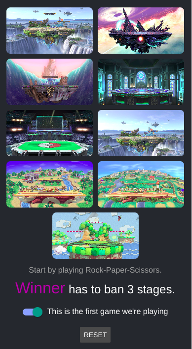
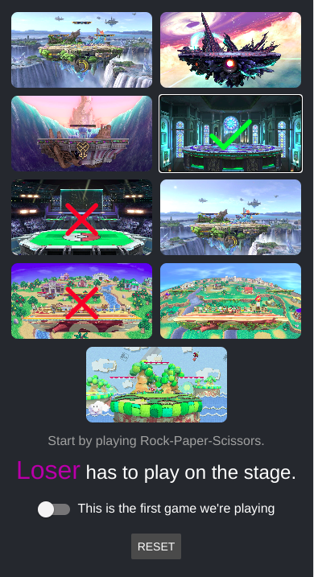

# Smash Bros Stage Selector

## Description
This React Native application is designed for Super Smash Bros. players to manage stage selection during competitive play. It allows players to ban and pick stages according to tournament rules, with different modes for first games and subsequent games in a set.

## How to Use
1. When you start the app, it defaults to the first game mode.
2. The Winner starts by banning 3 stages.
3. Then the Loser bans 4 stages.
4. Finally, the Winner picks 1 stage to play on.
5. For subsequent games, toggle the switch at the bottom of the screen.
6. In subsequent games, the Winner bans 2 stages, then the Loser picks the stage to play on.

## Features
- Visual grid of Smash Bros. stages
- Stage banning and picking functionality
- Toggle between first game and subsequent game rules
- Dynamic updating of bans remaining and player turn
- Responsive design for various screen sizes

## Technologies Used
- React Native
- Expo
- React Hooks (useState)

## Running the App yourself
To run the app in development mode:

1. Start the Expo development server:
`expo start`
2. Use the Expo Go app on your mobile device to scan the QR code displayed in the terminal or open the Expo app on the machine that is running the application directly in your browser.